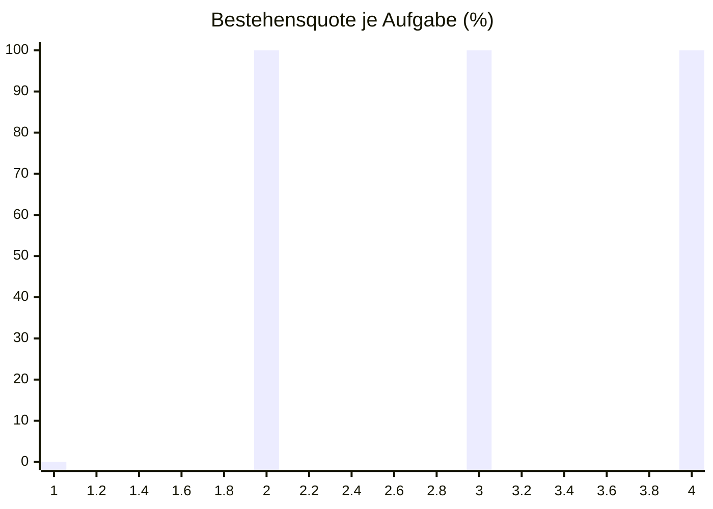

# Eval-Bericht 2026-10-08 13:13

- Commit: c6e8ff6
- Modell: Standard
- Läufe: 3 je Aufgabe, bestanden ab 2
- Kosten: $3.7072
- Dauer: 1247 s

| Aufgabe | Läufe | Ergebnis | Kosten | Erste fehlgeschlagene Prüfung |
| --- | --- | --- | --- | --- |
| wontfix-nach-closed-issue-closed | 0/3 | durchgefallen | $0.4721 | Schreibaufruf: gh issue close 7 --comment Übergang wontfix -> closed (issue_closed). |
| start-nach-status-in-progress-label-ready-for-agent | 3/3 | bestanden | $0.4083 | - |
| start-nach-status-in-progress-no-open-blockers | 3/3 | bestanden | $0.5596 | - |
| status-in-progress-nach-status-in-review-checks-success | 3/3 | bestanden | $0.5046 | - |

## Bestehensquote

